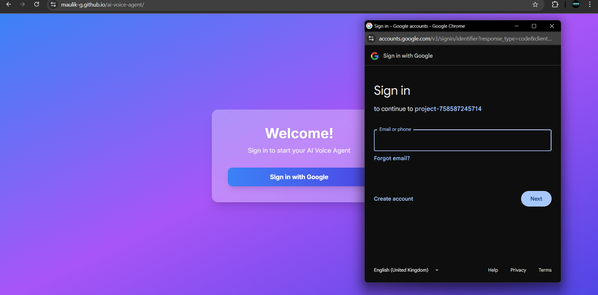
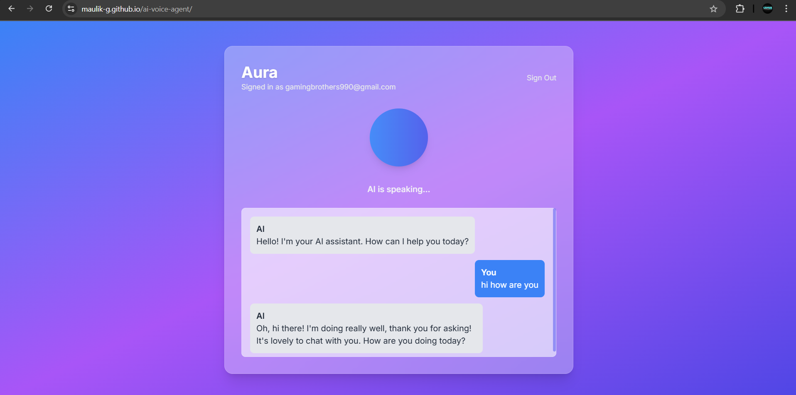

🎙️ AI Voice Agent

AI Voice Agent is a web application that lets you interact with an AI assistant using real-time voice conversations.
It supports secure authentication, connects to a Python backend for AI responses, and is deployed via GitHub Pages.

Live at - https://maulik-g.github.io/ai-voice-agent/

---

Project Screenshots

---

Features

- Secure Authentication with Firebase

- Real-time Voice Chat with the AI backend

- Frontend Web App with a modern UI (this repo)

- Deployed & Live via GitHub Pages

- Backend-powered AI responses (PythonAnywhere API)

---  

Tech Stack
Frontend (this repo)
- HTML / CSS / JavaScript

- Deployed on GitHub Pages

Backend
- Python (Flask) hosted on PythonAnywhere

- Handles AI response logic & text-to-speech / speech-to-text

Authentication
-Firebase Authentication (Google, Email/Password, etc.)

---

Setup & Installation
1. Clone the Repo
git clone https://github.com/Maulik-G/ai-voice-agent.git
cd ai-voice-agent

2. Open Locally

Just open index.html in your browser to preview the frontend.

3. Backend (PythonAnywhere)

Ensure your Python backend API is running.

Update the API URL in script.js if needed.

For reference, check /Backend/main.py

4. Firebase Authentication

Create a Firebase project.

Add your Firebase config inside script.js.

5. Deployment

Frontend → GitHub Pages (already live)

Backend → PythonAnywhere

---

🤝 Contributing

PRs are welcome! Please fork the repo and submit a pull request.

---

📜 License

This project is licensed under the MIT License.
